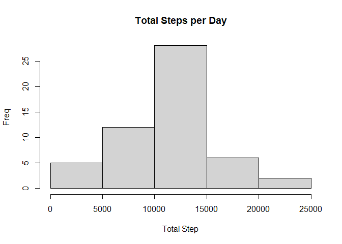
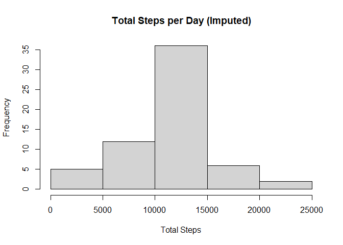
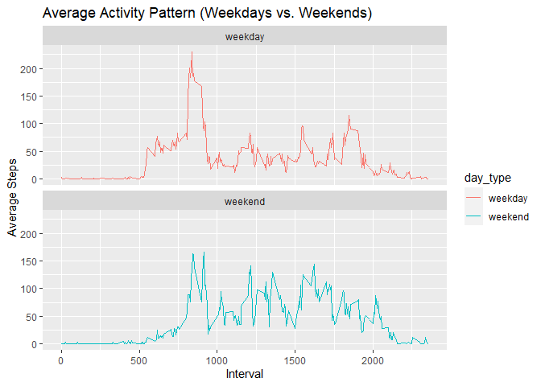

## Loading and preprocessing the data


```r
# Download and unzip the dataset
url <- "https://d396qusza40orc.cloudfront.net/repdata%2Fdata%2Factivity.zip"
zipfile <- "./data/activity.zip"
download.file(url, destfile = zipfile)
unzip(zipfile, exdir = './data')

#Load the data
data = read.csv('./data/activity.csv')
str(data)
```

```
## 'data.frame':	17568 obs. of  3 variables:
##  $ steps   : int  NA NA NA NA NA NA NA NA NA NA ...
##  $ date    : chr  "2012-10-01" "2012-10-01" "2012-10-01" "2012-10-01" ...
##  $ interval: int  0 5 10 15 20 25 30 35 40 45 ...
```

```r
#check missing values
missing_values = sum(is.na(data$steps))
missing_values
```

```
## [1] 2304
```

## What is mean total number of steps taken per day?


```r
# calculate total steps per day
total_steps_per_day = aggregate(steps ~ date, data, sum)

#create a hist
hist(total_steps_per_day$steps, main = 'Total Steps per Day', xlab = 'Total Step', ylab = 'Freq')
```

<!-- -->

```r
#calculate mean and median
mean_step = mean(total_steps_per_day$steps)
median_step = median(total_steps_per_day$steps)

sprintf('Mean = %s, Median = %s', mean_step, median_step)
```

```
## [1] "Mean = 10766.1886792453, Median = 10765"
```

## What is the average daily activity pattern?


```r
# calculate average steps for each interval

average_steps_by_interval = aggregate(steps ~ interval, data, mean)

# create a time series plot
plot(average_steps_by_interval$interval , average_steps_by_interval$steps, type = 'l',
     xlab = 'Interval', ylab = 'Average Steps', main ='Average Daily Activity Pattern')
```

<!-- -->

```r
#find the interval with the maxiumum average steps
max_interval = average_steps_by_interval[which.max(average_steps_by_interval$steps), ]
max_interval
```

```
##     interval    steps
## 104      835 206.1698
```

## Imputing missing values


```r
# fill missing values with mean for that interval

data_imputed = data
data_imputed$steps[is.na(data_imputed$steps)] = average_steps_by_interval$steps[match(data_imputed$interval[is.na(data_imputed$steps)], average_steps_by_interval$interval)]

#recalculate total steps per day with imputed data
total_steps_per_day_imputed = aggregate(steps ~date , data_imputed, sum)

#create hist and calculate mean and median with imputed data
hist(total_steps_per_day_imputed$steps, main = 'Total Steps per Day (Imputed)', xlab = 'Total Steps', ylab = 'Frequency')
```

<!-- -->

```r
mean_step_imputed = mean(total_steps_per_day_imputed$steps)
median_step_imputed = median(total_steps_per_day_imputed$steps)
sprintf('Mean = %s, Median = %s', mean_step, median_step)
```

```
## [1] "Mean = 10766.1886792453, Median = 10765"
```

## Are there differences in activity patterns between weekdays and weekends?


```r
# Create a factor varb. for weekdays and weekends
data_imputed$day_type = ifelse(weekdays(as.Date(data_imputed$date)) %in% c('Saturday','Sunday'), 'weekend', 'weekday')

# Calculate average steps by interval for weekdays and weekends
average_steps_by_interval_day = aggregate(steps ~ interval + day_type, data_imputed, mean)

#create panel plot
library(ggplot2)
ggplot(average_steps_by_interval_day, aes(x=interval, y=steps, color=day_type)) +
        geom_line() +
        facet_wrap(~day_type, ncol = 1) +
        labs(x='Interval', y='Average Steps', title ='Average Activity Pattern (Weekdays vs. Weekends)')
```

<!-- -->
